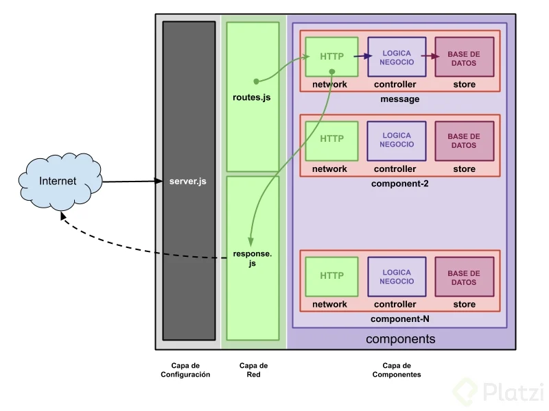

# Backend Node

This project creates a simple Node Express API for chats.

- It uses webSockets, MongoDB and Express.

In order to run the project you need to add the:

- user,
- pass,
- host,
- database

to the config.js file inside the project!

## Dependencies

- `express` as the backend framework
- `nodemon` is a tool that helps develop node.js based applications by automatically restarting the node application when file changes
- `body-parser` let us work with the request body very easily (DEPRECATED)
- `Mongoose` let us create schemas by software, handles the db connection
- `multer` let us work with files, managing them, transfering them, etc
- `socket.io` massive communication protocol, that keeps the connection alive (client-server)

## Key things

- `Router` let us split our requests
- `req.body` to read body
- `red.query` to read query params
- `req.headers` to read headers

## Notes

- for Express 4.16.0 and higher: body parser has been re-added to provide request body parsing support out-of-the-box.

# Architecture explanation

### Layer 0

- `server.js:`

  - Checks that the requests are correct
  - Cancel bad requests
  - General configuration of the API, DB, headers, routers, all what we need

### Layer 1 (Network layer)

- `routes.js`

  - Manage all the routes
  - It will let you call the right component

- `response.js`
  - It grabs the responses of the components and process them

### Layer 2 (Components)

It has 4 sublayers

- `network.js` it is the entry point of the component, it interacts with the controller
- `controller.js` it has the logic of the component (business logic) it sends information to be store to `store.js`
- `store.js` controls the DB (Mongo, MySWL, etc)
- `model.js` In this case as we are using MongoDB and Mongoose, it defines the shape of the data we want to store, and interacts with MongoDB.

### Notes in Spanish

Cualquier aplicación va a tener tres puntos de responsabilidad, que deben responder a tres preguntas:

- ¿Cómo me comunico con ella?
- ¿Qué hace?
- ¿Dónde y cómo se guardan los resultados?

La respuesta a estos tres puntos, corresponden a las tres capas que vamos a generar:

- Capa de red (en inglés “network”)
- Capa controladora (en inglés, “controller”)
- Capa de almacenamiento (en inglés, “store”)

La primera capa es una capa de red, porque la conexión con la aplicación se hace a través del protocolo de comunicación en red HTTP. Es la responsable de comunicar al cliente HTTP con el código del controlador.

El protocolo HTTP construye una petición con una dirección (route), un verbo (method), unas cabeceras (headers) y un mensaje (body).

Por esto, cada uno de los componentes, tendrá un archivo “network.js” encargado de traducir la petición del cliente HTTP a la acción que queremos realizar en el controlador.

Así, lo que hace el código (la funcionalidad) no está acoplado a unos requisitos de red, y puede ser reutilizado con otras fuentes de entrada (colas MQTT, una biblioteca externa, microservicios…).
